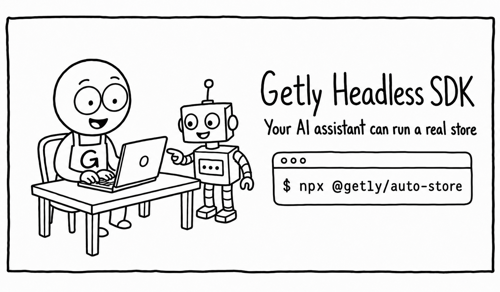

<div align="center">



**Give your AI assistant an API key. Get back a running digital-products business.**

Products · Card + crypto checkout · File delivery · License keys · Blog · Payouts — all driven by API, SDK, or MCP.

[](https://github.com/Getly-Store/headless-sdk/actions/workflows/ci.yml)
[](LICENSE)
[](https://www.getly.store/developers)

[Quickstart](#quickstart) · [MCP](#-mcp--your-ai-runs-the-store) · [Packages](#-whats-in-the-box) · [Pricing honesty](#-what-it-costs-no-fine-print) · [Examples](#-examples)

</div>

---

## The 30-second version

You're a vibe coder. You build with Cursor, Claude, Copilot, v0, Lovable. You have things worth selling — templates, code, prompts, courses, music — and zero desire to build carts, webhooks, tax-safe payment flows, file CDNs and payout rails.

**Getly is that backend, already running.** This repo is everything your AI needs to drive it:

```bash
# Point AI at a folder. Get a live product + a selling blog post + a pay link.
npx @getly/auto-store ./my-icon-pack --dry-run
```

Behind that one command: Claude reads your folder, writes an honest product listing and an SEO article, uploads your files (up to 2GB), publishes to a marketplace with 708 categories, and hands you a checkout link that accepts **cards and USDT/USDC** — with delivery, receipts and license keys handled.

> 🎬 *Demo GIF coming — run the command above with `--dry-run` to see the plan without writing anything.*

## Quickstart

**1. Get an API key** (one manual step, ~2 minutes): [getly.store/dashboard/developer/keys](https://www.getly.store/dashboard/developer/keys) → create a key with the scopes you need.

**2. Sell your first product:**

```ts
import { Getly } from '@getly/sdk';

const getly = new Getly(); // reads GETLY_API_KEY from env

const product = await getly.products.create({
  name: 'Neon UI Kit',
  priceCents: 1900,                    // money is ALWAYS integer cents
  shortDescription: '120 dark-mode components for Figma',
});

await getly.products.uploadFile(product.id, {
  fileName: 'neon-ui-kit.zip',
  data: await fs.readFile('./neon-ui-kit.zip'),
});

const live = await getly.products.publish(product.id);
console.log(live.urls.buy); // → share it. Getly handles checkout + delivery.
```

**3. Sell inside a conversation** (bots, support chats, anywhere):

```ts
const link = await getly.checkoutLinks.create({
  productId: product.id,
  couponCode: 'FRIENDS20',
  reference: chatId,            // echoed back in the sale.completed webhook
});
// → link.url — buyer pays by card or crypto, no Getly account needed.
```

Prefer curl? The full copy-paste flow with expected responses: **[getly.store/developers](https://www.getly.store/developers)**.

## 🤖 MCP — your AI runs the store

The part nobody else ships. Add Getly to Claude Code:

```bash
claude mcp add getly --env GETLY_API_KEY=your_key -- npx -y @getly/mcp
```

or Cursor (`.cursor/mcp.json`):

```json
{ "mcpServers": { "getly": { "command": "npx", "args": ["-y", "@getly/mcp"], "env": { "GETLY_API_KEY": "your_key" } } } }
```

Now this is a conversation, not a coding session:

> *"Upload everything in ~/designs/spring-pack as a new product at $24, write a launch post for my blog, and give me a 15%-off link I can share on X."*

18 tools: products (create/update/publish/upload), blog posts, coupons, checkout links, licenses, sales stats, category search. Destructive actions require explicit confirmation — a prompt-injected review can't nuke your store. `npx @getly/mcp init` writes the config for Claude Code / Cursor / Claude Desktop / Windsurf for you.

## 📦 What's in the box

| Package | What it does |
|---|---|
| [`@getly/sdk`](packages/sdk-js) | Zero-dependency TypeScript client. Auto idempotency keys, rate-limit-aware backoff, one-call 2GB uploads, webhook signature verification, cursor iterators. |
| [`@getly/mcp`](packages/mcp) | The MCP server above. `init` command, Smithery-ready. |
| [`@getly/nextjs`](packages/nextjs) | `Checkout()` + `Webhooks()` route handlers — Polar-style one-liners for Next.js. |
| [`@getly/auto-store`](packages/auto-store) | The folder → live store CLI (Claude-powered). |
| [`create-getly-store`](packages/create-getly-store) | `npx create-getly-store my-shop` → a deployable Next.js storefront wired to your Getly store. |
| [`examples/`](examples) | Telegram sales bot (sells in-chat, confirms payments), dependency-free storefront widget, one-line **Pay Widget** buy button. |
| [**Pay Widget**](docs/pay-widget.md) | One `<script>` + a Buy button adds checkout (card + Apple Pay / Google Pay) to **any** site — no API key in the browser, no Stripe account for the seller. Getly delivers the file. |
| [`openapi/getly-v1.yaml`](openapi/getly-v1.yaml) | The whole API, OpenAPI 3.1, examples on every operation. Also served at [getly.store/openapi.yaml](https://www.getly.store/openapi.yaml). |
| [`llms.txt`](llms.txt) | The entire API reference as one file your AI can swallow. Also at [getly.store/llms-api.txt](https://www.getly.store/llms-api.txt). |
| [`AGENTS.md`](AGENTS.md) | The golden prompt: paste into Cursor/ChatGPT and your AI uses the API correctly on the first try. |

## 💸 What it costs (no fine print)

Sales you drive through this SDK — API checkout links, the Pay Widget on your own site, your Telegram store — are **your own traffic: Getly takes 10%, you keep 90%. Always.** Sales the Getly marketplace brings you start at 20% and drop with volume (17% / 15% / 12% by prior-month sales). No monthly fee, no listing fee, no file-hosting bill, no payment-gateway setup. Full model with a live calculator: [getly.store/pricing](https://www.getly.store/pricing).

| | **Getly (10% all-in on your own traffic)** | Typical payments-API stack (4–10% + fixed) |
|---|---|---|
| Payment processing (cards) | ✅ included | ✅ that's the 4–10% |
| **Crypto checkout + crypto payouts** (USDT/USDC, 5 chains) | ✅ included | ❌ |
| File hosting + delivery up to 2GB | ✅ included | ❌ bring your own S3/CDN |
| **Marketplace traffic** (708-category catalog, search, AI recommendations) | ✅ included | ❌ you bring 100% of traffic |
| License key issue + validation API | ✅ included | varies |
| Affiliate network + referral program | ✅ included | ❌ |
| Chargebacks, receipts, refund plumbing | ✅ handled | partially |
| Fixed monthly cost | **$0** | $0–29+ |

**New sellers keep 90% on everything for their first 3 months.** And the old honest caveat — «if you only need payment rails, a 4% API might be cheaper» — mostly died with the 10% own-traffic rate: at 10% all-in (processing, hosting, delivery, crypto, licenses, chargebacks included) versus 4–10% + fixed fees + everything above being your problem, the rails-only stack rarely wins anymore. We'd still rather you do that math than discover it angry. Tax note: Getly handles payments, delivery, refunds and chargebacks; sellers remain responsible for their own income/VAT obligations ([details](https://www.getly.store/faq)).

## 🌍 Why builders actually pick Getly

- **Crypto payouts, no bank needed.** USDT/USDC on Ethereum/Tron/BSC/Polygon/Solana, paid twice a month. If Stripe doesn't serve your country, we still do.
- **Guest checkout.** Your buyers pay with an email and a card — no forced account creation killing your funnel.
- **MCP-first.** Not "we have an API" — your AI assistant has *tools*.

## ⚙️ The honest bootstrap

"Fully AI-managed" has exactly **3 human steps**, ~5 minutes total:

1. Sign up at [getly.store](https://www.getly.store) (Google/GitHub/magic link).
2. Create an API key → [dashboard/developer/keys](https://www.getly.store/dashboard/developer/keys) (creates your store automatically if needed).
3. To get *paid*: click one Stripe onboarding link **or** paste a crypto wallet address (`POST /api/v1/store/payout-onboarding` returns the link — even this step is API-driven).

Everything after that — products, blog, discounts, checkout links, licenses — is your AI's job.

## 🧪 Try the money flow without money

Create a $0 product (or a 100%-off coupon), run the full checkout-link → guest-checkout → `sale.completed` webhook loop for free, then flip the real price. The recipe is in [AGENTS.md](AGENTS.md#test-without-money).

## 📚 Examples

- [**Telegram sales bot**](examples/telegram-sales-bot) — sells your catalog in chat, drops pay links, confirms payment in the thread. The "AI closes deals mid-conversation" demo, running on a laptop.
- [**Storefront widget**](examples/storefront-widget) — one `<script>` + one `<div>` on any site (v0, Lovable, Webflow, plain HTML) renders your products with Buy buttons. No API key in the browser, ever.
- [**Pay Widget**](examples/pay-widget) — one `<script>` + a Buy button turns any site into a checkout for a single product. Card + Apple Pay / Google Pay on a hosted popup; Getly delivers the file and handles receipts + refunds. Full guide in [`docs/pay-widget.md`](docs/pay-widget.md).
- [**React snippets**](docs/react-snippets.md) — copy-paste `<GetlyStorefront/>` and `<GetlyBuyButton/>` for generated apps, plus a [ready prompt for v0/Lovable/Bolt](docs/v0-lovable-prompt.md).

## 🗺 Roadmap

Hosted remote MCP (`mcp.getly.store`, OAuth — connect from claude.ai/ChatGPT without local config) · test-mode API keys · batch product endpoint · GitHub secret-scanning partnership for `getly_sk_live_` keys · device-code CLI login · Python SDK ([help wanted](https://github.com/Getly-Store/headless-sdk/issues)).

## 🔐 Security, briefly

Keys are `getly_sk_live_…`, scoped, rotatable with a 24h grace overlap, and belong in env vars — every tool here refuses to accept them any other way. Webhooks are HMAC-signed with timestamps (`verifyWebhookSignature` in the SDK). The MCP server annotates destructive tools and demands confirmation. Full guidance: [AGENTS.md](AGENTS.md#security-rules).

## Contributing & community

Questions → [GitHub Discussions](https://github.com/Getly-Store/headless-sdk/discussions). Bugs/ideas → [issues](https://github.com/Getly-Store/headless-sdk/issues). Dev setup and the minimal-dependency policy → [CONTRIBUTING.md](CONTRIBUTING.md). Built something? Add it to [SHOWCASE.md](SHOWCASE.md).

MIT. Sell well. 🟢
